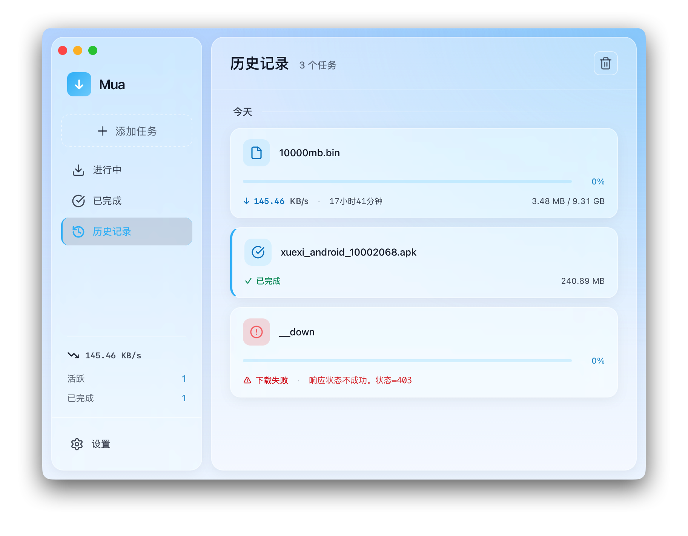
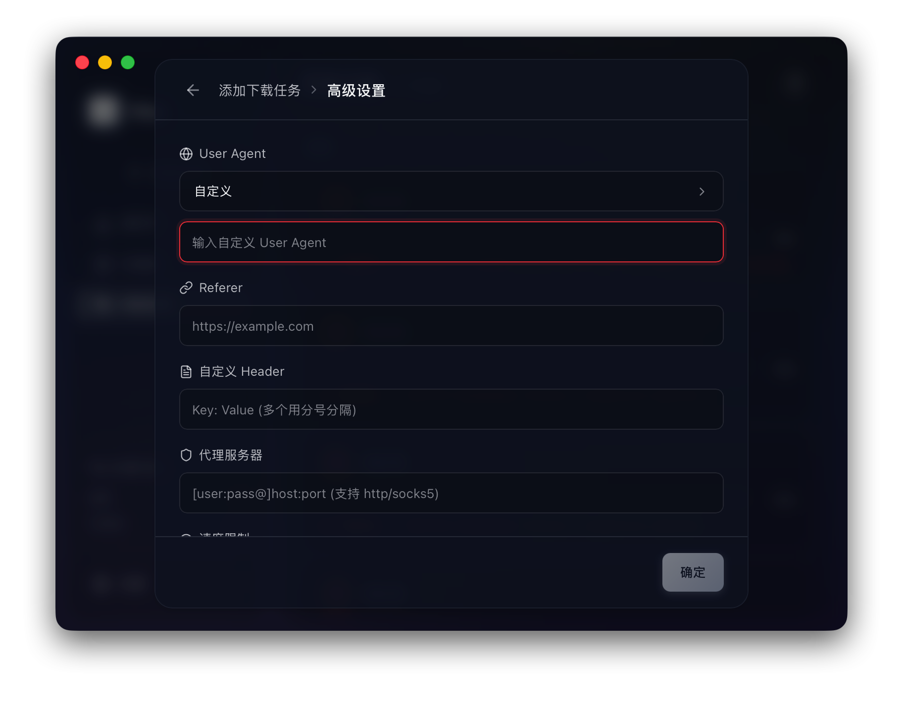
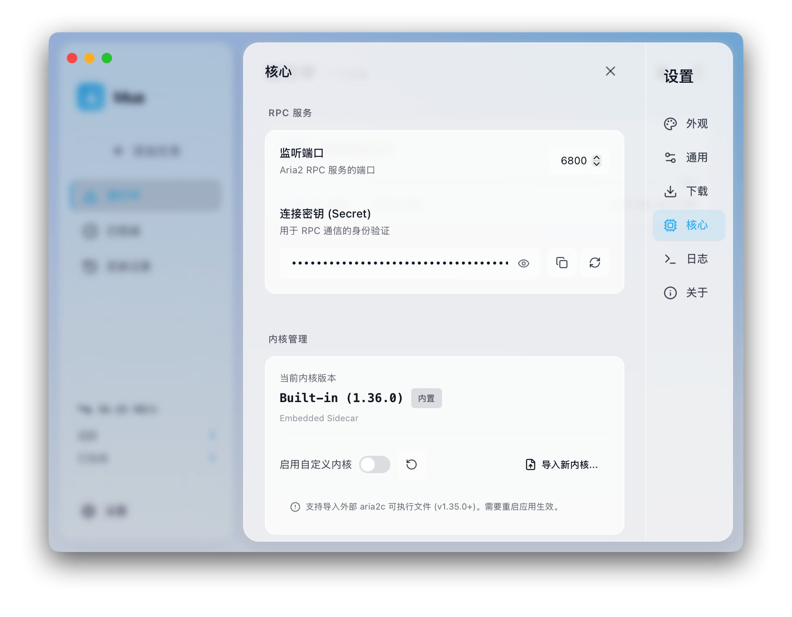

# Mua

<p align="center">
  
</p>

<p align="center">
  <strong>现代化的 Aria2 下载管理器</strong>
</p>

<p align="center">
  <a href="./LICENSE"></a>
  
  
  
  
</p>

<p align="center">
  基于 Tauri 2.0 + SvelteKit + Svelte 5 构建的极简下载管理器。
</p>

> **特别说明**：本项目是在与 **Gemini Pro** (DeepMind) 的深度 AI 协作下开发完成的，展示了人类创意与大语言模型协同编写复杂跨平台应用的实践。
> 由于项目包含大量 AI 生成与优化的逻辑，可能存在未知的 Bug 或不尽完善之处，恳请各位开发者与用户予以宽容。如遇问题，欢迎通过 Issue 诚挚反馈。

## 📸 运行截图

<p align="center">
  
</p>

<p align="center">
  
</p>

<p align="center">
  
</p>

<p align="center">
  
</p>

<p align="center">
  
</p>

<p align="center">
  
</p>

---

## ✨ 特性
- 🚀 **高性能下载** - 基于 aria2c 多线程下载引擎，支持 EMA 速度平滑算法
- 🛠️ **高度可定制** - 支持 **自定义 aria2 内核** 与 **自定义配置文件**
- 🎨 **现代化 UI** - 基于 shadcn-svelte + Tailwind CSS v4 构建的精美界面
- 📦 **轻量打包** - 基于 Tauri 2.0，体积小、性能强、资源占用极低
- 💻 **多平台支持** - 内置 macOS (Intel) 与 Windows (x64) 二进制内核，支持手动扩展

## 🛠️ 技术栈

| 层级 | 技术 | 版本 |
|------|------|------|
| 构建框架 | Tauri | 2.0 |
| 前端框架 | SvelteKit (SPA) | Svelte 5 |
| 状态管理 | Svelte Store + Service Layer | 内置 |
| UI 组件 | shadcn-svelte | latest |
| 样式 | Tailwind CSS | v4 |
| 后端 | Rust | latest |
| 下载引擎 | aria2c | JSON-RPC 2.0 |

## ⬇️ 下载与安装

请前往 [Releases](https://github.com/beyoug/mua/releases) 下载最新版本。

| 平台 | 安装包格式 | 状态 | 说明 |
|------|-----------|------|------|
| **macOS** (Intel) | `.dmg` | ✅ 默认内置 | 适用于 Intel 处理器的 Mac |
| **Windows** (x64) | `.msi` 或 `.exe` | ✅ 默认内置 | 标准 64 位安装包 |
| **macOS** (Apple Silicon) | - | ⚠️ 需手动集成 | M1/M2/M3 及后续芯片版本 |
| **Linux** | - | ⚠️ 需手动集成 | 需自行准备 Linux 静态二进制文件 |

> [!TIP]
> 开发者可以通过 [贡献指南的 Sidecar 集成章节](./CONTRIBUTING.md#🌍-多平台支持与-sidecar-集成) 了解如何自行编译或集成其他平台的二进制内核。

---

## 📦 快速开始

### 环境要求

- **Node.js** >= 20
- **pnpm** >= 9
- **Rust** >= 1.77
- **Tauri 编译环境** (详见 [贡献指南](./CONTRIBUTING.md))

### 安装并运行

```bash
pnpm install
pnpm tauri:dev
```

## 🗺️ 路线图 (Roadmap)

- [x] 基于 Tauri 2.0 的核心下载功能
- [x] 多任务并行管理与速度估算 (EMA)
- [ ] 种子文件 (BitTorrent) 与磁力链接支持
- [ ] 浏览器扩展集成
- [ ] 国际化 (i18n)

## 🤝 参与贡献

我们欢迎并感谢任何形式的贡献！在开始之前，请阅读我们的 [贡献指南](./CONTRIBUTING.md)。

## 💬 交流与反馈

- **Issue**: 提交 bug 或功能建议
- **Discussions**: 参与社区讨论

## 📄 许可证

本项目基于 [MIT](./LICENSE) 许可证开源。

## 🙏 致谢

- [Tauri](https://tauri.app/) - 跨平台桌面应用框架
- [SvelteKit](https://kit.svelte.dev/) - 现代 Web 框架
- [shadcn-svelte](https://www.shadcn-svelte.com/) - 精美的 UI 组件库
- [aria2](https://aria2.github.io/) - 强大的下载引擎
- [Gemini Pro](https://deepmind.google/technologies/gemini/) - AI 协作开发伙伴
