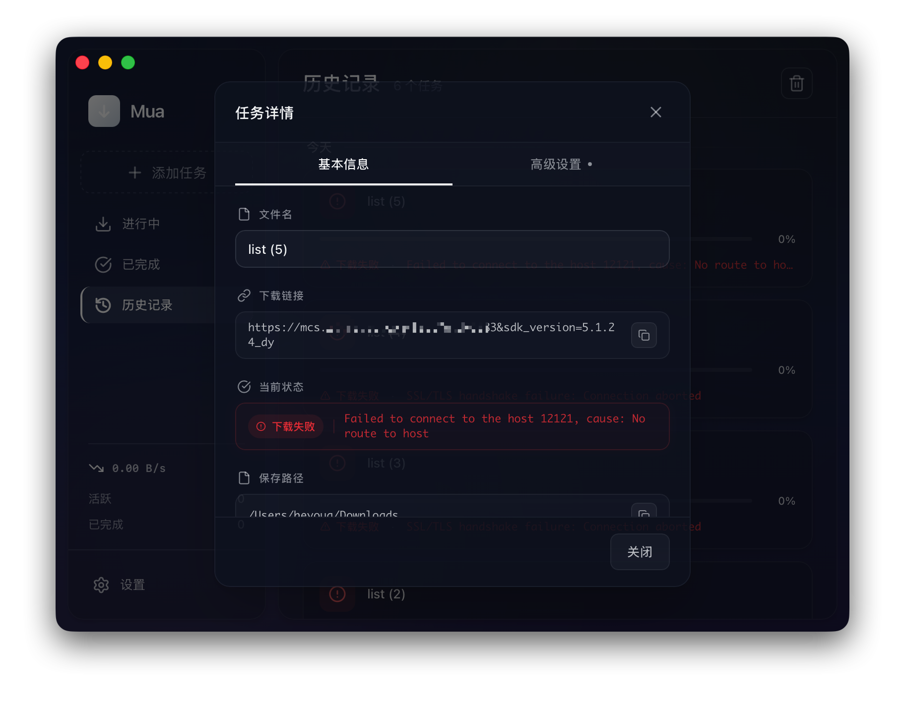

# Mua

<p align="center">
  
</p>

<p align="center">
  <strong>Modern Aria2 Download Manager · 现代化 Aria2 下载管理器</strong>
</p>

<p align="center">
  <a href="./LICENSE"></a>
  
  
  
  
</p>

<p align="center">
  基于 Tauri 2.0 + SvelteKit + Svelte 5 构建，专注于性能、可扩展性与清晰交互体验。
</p>

## 概览 (Overview)

Mua 是一个跨平台桌面下载管理器，核心基于 aria2c，并通过统一的服务层抽象下载任务管理、配置管理与 UI 状态同步。

- 面向日常下载与高并发任务
- 提供可扩展的 Sidecar 集成能力
- 采用 Service-First 架构，便于维护与贡献

## ✨ 特性 (Features)

- 🚀 **高性能下载**：基于 aria2c 多线程能力，支持 EMA 速度平滑算法
- 🧩 **可扩展内核**：支持自定义 aria2 内核与配置文件
- 🎨 **现代化界面**：基于 shadcn-svelte + Tailwind CSS v4
- 📦 **轻量发布**：基于 Tauri 2.0，兼顾体积与性能
- 💻 **跨平台支持**：默认覆盖 macOS (Intel) / Windows (x64)，并支持手动扩展

## 📸 运行截图 (Screenshots)

<p align="center">
  
  
</p>

<p align="center">
  
  
</p>

<p align="center">
  
  
</p>

## 🛠️ 技术栈 (Tech Stack)

| 层级 | 技术 | 版本 |
|------|------|------|
| 桌面框架 | Tauri | 2.0 |
| 前端框架 | SvelteKit (SPA) | Svelte 5 |
| 状态管理 | Svelte Store + Service Layer | 内置 |
| UI 组件 | shadcn-svelte | latest |
| 样式系统 | Tailwind CSS | v4 |
| 后端语言 | Rust | latest |
| 下载引擎 | aria2c | JSON-RPC 2.0 |

## ⚡ 快速开始 (Quick Start)

### 环境要求

- **Node.js** >= 20
- **pnpm** >= 9
- **Rust** >= 1.77
- **Tauri 编译环境**（参考 [Tauri Prerequisites](https://tauri.app/v2/guides/getting-started/prerequisites)）

### 安装并运行

```bash
pnpm install
pnpm tauri:dev
```

## ⬇️ 下载与安装 (Releases)

请前往 [GitHub Releases](https://github.com/beyoug/mua/releases) 下载最新版本。

| 平台 | 安装包格式 | 状态 | 说明 |
|------|-----------|------|------|
| **macOS** (Intel) | `.dmg` | ✅ 默认内置 | 适用于 Intel 处理器 Mac |
| **Windows** (x64) | `.msi` / `.exe` | ✅ 默认内置 | 标准 64 位安装包 |
| **macOS** (Apple Silicon) | - | ⚠️ 需手动集成 | M1/M2/M3 及后续芯片 |
| **Linux** | - | ⚠️ 需手动集成 | 需自行准备 Linux 静态二进制 |

> [!TIP]
> 如需自行编译或集成 Sidecar，请查看 [contributing.md](./docs/contributing.md#多平台支持与-sidecar-集成)。

## 🧱 项目文档 (Project Docs)

- [docs/contributing.md](./docs/contributing.md)：贡献流程、开发环境与 Sidecar 指南
- [docs/development-standards.md](./docs/development-standards.md)：Service-First 开发规范与质量门禁
- [docs/design-system.md](./docs/design-system.md)：UI 设计系统规范与落地清单

## 🔐 自定义内核安全模型 (Custom Kernel Security Model)

Mua 对导入的自定义 aria2 内核采用“导入 → 信任确认 → 启用”的安全流程：

1. 导入后计算并记录二进制 SHA-256 哈希。
2. 默认不自动信任、不自动启用。
3. 用户首次启用时需显式确认信任来源。
4. 启动前会重新校验哈希；若不匹配则自动回退内置内核。

设置页提供统一安全状态：`missing` / `untrusted` / `hash_mismatch` / `trusted`，用于快速判断当前内核可信度。

## 🤖 AI 协作说明 (AI-assisted Development)

Mua 在开发过程中使用了多种 AI 工具进行代码实现、重构建议与文档协作，包括：

- **OPENCODE**
- **Gemini**
- **Claude Code**
- **GPT-5.x**

AI 产出会经过人工审阅，但仍可能存在边界场景问题。欢迎通过 Issue 提交复现步骤，我们会持续改进。

## 🗺️ 路线图 (Roadmap)

- [x] 基于 Tauri 2.0 的核心下载功能
- [x] 多任务并行管理与速度估算 (EMA)
- [ ] 种子文件 (BitTorrent) 与磁力链接支持
- [ ] 浏览器扩展集成
- [ ] 国际化 (i18n)

## 🤝 参与贡献 (Contributing)

欢迎任何形式的贡献。在开始之前，请阅读 [贡献指南](./docs/contributing.md)。

## 💬 交流与反馈 (Feedback)

- **Issues**：提交 Bug / Feature Request
- **Discussions**：参与社区讨论

## 📄 许可证 (License)

本项目基于 [MIT](./LICENSE) 许可证开源。

## 🙏 致谢 (Acknowledgements)

- [Tauri](https://tauri.app/) - 跨平台桌面应用框架
- [SvelteKit](https://kit.svelte.dev/) - 现代 Web 框架
- [shadcn-svelte](https://www.shadcn-svelte.com/) - 精美的 UI 组件库
- [aria2](https://aria2.github.io/) - 强大的下载引擎
